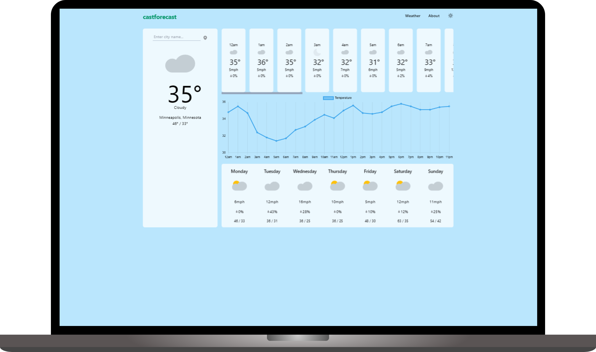

# castforecast


Our app is user-friendly and intuitive, so you don't need to be a meteorologist
to understand the data. With just a few clicks, you can see the forecast for the
next few days and get a sense of the overall weather patterns in your area.<br><br>



<br>

## Technlogies 

- React
- TailwindCSS
- API from [OpenMeteo](https://open-meteo.com/)

<br>

## Build and Deploy
*prerequisite:* Node

1. clone the git repo: 
   ```bash
   git clone <link to this repo>
   ```
2. In project root directory: 
   ```bash
   npm install
   ``` 
3. To build the bundle: 
   ```bash
   npm run build
   ```
4. Run the server (default port 3000)
   ```bash
   npm run start
   ```
**modify scripts in package.json*

<br>

<hr>


This project is free to use and modify.<br>
[](https://opensource.org/licenses/MIT)<br>

Inspired by [The Odin Project's](https://www.theodinproject.com/) curriculum<br>
Additional reference for SPA and accessibility: [a11y](https://a11y-guidelines.orange.com/en/articles/single-page-app/) 
<br>
Icons sourced from [Heroicons](https://heroicons.com/), [SVGRepo](https://www.svgrepo.com/)
